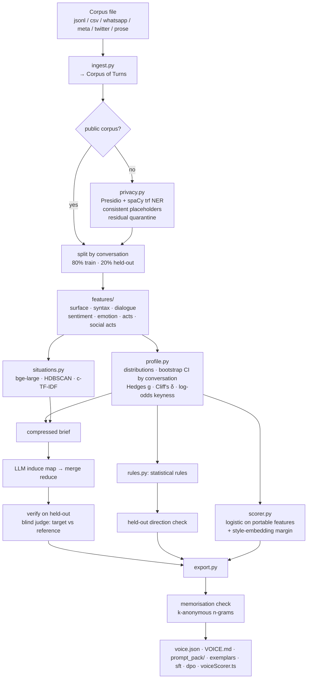
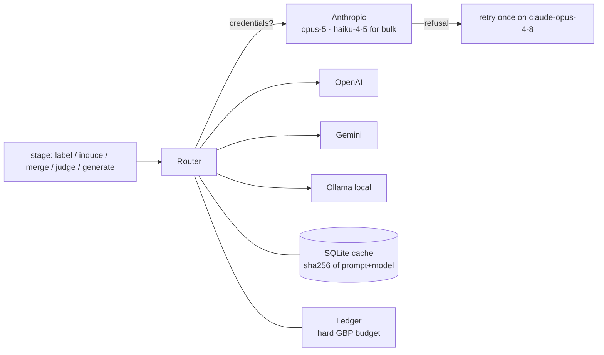

# Voiceprint build log

A running record of how Voiceprint was built: the architecture, the data flow, every decision with
its reason, the files, and what each test run showed. Entries are dated. Newest results are at the
bottom of each section.

Plan: `C:\dev\WorkSummaryHarsh\VOICEPRINT_PLAN.md` (approved 2026-09-24).

---

## 1. What it is

Voiceprint takes a text corpus (DMs, support threads, emails, a novel) and a target speaker. It
returns that speaker's **voice** as:

- **measurements**: about 155 per-turn features, compared against a reference, with confidence
  intervals and effect sizes;
- **rules**: plain-language instructions ("Open with the reader's first name"). Each rule is
  verified on conversations the rule-writer never saw;
- **artefacts to tune an LLM with**: prompt packs at three lengths, exemplars for few-shot
  retrieval, SFT and DPO training files;
- **a scorer** that estimates how on-voice a new message is. It is a calibrated logistic model that
  also ships as a dependency-free TypeScript file.

It runs locally on one consumer GPU. LLM stages are optional: the Claude API is the default, with
OpenAI, Gemini and Ollama behind the same interface.

## 2. Architecture

### Processing tiers (privacy ↔ accuracy)

| Tier | What leaves the machine | When to use |
|---|---|---|
| `local-first` (default) | only a compressed statistical brief and a small sample of anonymised, k-anonymous turns | private data on any provider |
| `hybrid` | every anonymised turn, for LLM labelling | more budget, zero-retention agreement |
| `frontier-direct` | raw text; refused unless `privacy.raw_to_provider_acknowledged: true` | production with a DPA and zero data retention |

`llm/router.py` enforces these tiers in one place. It also refuses to send a private corpus to a
Gemini key that cannot be confirmed as paid tier, because the free tier may use submitted content.

### LLM layer

## 3. Decisions

| # | Decision | Why |
|---|---|---|
| D-01 | Measure first, then let the LLM write rules from a compressed brief. Do not hand the frontier model the whole corpus. | A 10k-turn corpus costs roughly 30× more tokens raw. The frontier model reasons better over distilled statistics than over noise. Statistics are also reproducible and checkable, while an LLM's impression of a corpus is neither. The `frontier-direct` tier still exists for teams that have the budget and a DPA. |
| D-02 | Every rule is verified on held-out conversations by a blind judge, which labels target and reference turns shuffled together. A rule is kept only if the target follows it clearly more often than the reference does. | Unverified rules are how voice guides fill up with "be friendly". Keeping a rule requires it to be both *true* of the target and *distinctive* from others. |
| D-03 | BERTopic replaced by ~20 lines: bge-large embeddings, scikit-learn HDBSCAN, class-based TF-IDF. KMeans + silhouette fallback for small corpora. | BERTopic pulls in umap/numba/hdbscan builds that are fragile on Windows. The part we need is small. |
| D-04 | Social acts (greet, thank, apologise, offer, request, reassure, refuse, empathise, inform, close) use zero-shot NLI **per sentence, max over the message**, plus strict cue phrases. The cues alone decide greet/thank/apologise/refuse. | Measured in the smoke test (see §6). Renormalising entailment against contradiction over-fired: a refusal came out labelled "greet" and "close". Message-level premises under-fired. Per-sentence scoring plus formulaic cues gave correct labels on every probe. |
| D-05 | Anonymisation replaces locations and dates only when they are specific (a street, a full date). "London" and "next week" are kept. | Generic mentions carry register, not identity. Replacing them all distorts the voice being measured. |
| D-06 | The primary formality measure is the Heylighen–Dewaele F-score, computed from POS rates. The s-nlp formality model is optional and research-only. | The model is CC BY-NC-SA and cannot be used commercially. The F-score is licence-free and well cited. |
| D-07 | Every Hugging Face model is pinned to a commit hash. Models load per stage and are released afterwards. Text longer than the model window is split on sentences and length-weighted, never truncated. | Reproducibility, and peak GPU memory of about one model (under 8 GB). |
| D-08 | Rule induction is map-reduce: several chunked induce calls, then one merge call in which the statistics win conflicts. | This scales with corpus size. The merge step removes duplicates and contradictions. |
| D-09 | Dialogue acts come from `diwank/silicone-deberta-pair`, conditioned on the previous turn. We did not fine-tune on SwDA. | It was trained on SILICONE (a superset including SwDA-style labels) and needs no training run. The pair input gives it the conversation context acts depend on. |
| D-10 | Opus 5 is the default for induce, merge, judge and generate. Haiku 4.5 is used only for bulk per-turn labelling in the hybrid tier. A refusal retries once on Opus 4.8. | Quality where reasoning matters, cost only where volume matters. |
| D-11 | Qwen 2.5 7B through Ollama is a fallback provider only. We skipped QLoRA training on this machine. | About 20 GB of free disk. The SFT/DPO files are exported so tuning can run anywhere. |
| D-12 | Until `ANTHROPIC_API_KEY` is set, public-corpus tests use Gemini. Private data never goes to Gemini (see the router guard). | Lets the LLM path be tested now without breaking the privacy rule. |
| D-13 | cupy-cuda12x pinned to 13.3.0. | The latest CuPy hit a DLPack error with spaCy on this machine. |
| D-14 | torch 2.6.0+cu124, with a matching torchvision inside the venv. | transformers refuses `.bin` checkpoints on torch < 2.6 (CVE-2025-32434), and two pinned models ship only `.bin`. Safetensors conversions exist only as community PRs, and pinning unreviewed weights is a supply-chain risk. The venv sees system site-packages, so it needs its own torchvision to shadow the global 0.20. |
| D-15 | Classifier weights stay fp32 and inference runs under CUDA autocast. The dialogue-act model (DeBERTa v1) runs pure fp32. | Casting weights to fp16 broke DeBERTa v1 ("expected Half but found Float"). Under autocast its mask fill overflowed fp16. It is a base-size model, so fp32 costs little. |
| D-16 | Confidence intervals bootstrap *whole conversations*, not turns. | Turns in one chat are not independent, so resampling turns overstates confidence. |
| D-17 | Lexical keyness uses Monroe et al. (2008) log-odds with an informative Dirichlet prior. | Raw frequency ratios explode on rare words in small corpora. |
| D-18 | The scorer is a logistic regression over *portable* surface features, validated by grouped CV. A style-embedding margin is added in Python only. | It has to run in Kiki's TypeScript with no model. Being linear, its weights are also readable. |
| D-19 | The CLI forces UTF-8 on stdout and stderr. | Windows consoles default to cp1252 and crashed on "▸" and emoji. |
| D-20 | A memorisation check runs over every published text. Any rare corpus 8-gram (seen in fewer than k=3 conversations) fails the run. Exemplars must pass k-anonymity on 5-grams. | Voice artefacts get shared, and they must not leak what someone said. |
| D-21 | Emotions are presence flags (GoEmotions p ≥ 0.3). Raw probabilities are `_p` diagnostic columns that never become rules. | Planted eval: means of raw probabilities (0.004 vs 0.0007) produced large effect sizes with no practical meaning, and so eight false "Express love/surprise…" rules. |
| D-22 | Bounded features need an absolute difference ≥ 5 points to become a rule, on top of significance and effect size. | Statistical significance is not practical significance. |
| D-23 | Redundancy pruning: in distinctiveness order, a feature correlating at \|r\| ≥ 0.8 with an already-kept one is folded into it and named in the rationale ("also measured by …"). Correlation is **within group**: each feature is centred on its target and reference means. | Otherwise one fact becomes four rules (ends with a question / questions per sentence / act "ask" / asks back). Pooled correlation is dominated by group membership, since any two target-only traits look perfectly correlated. That wrongly folded "opens with a name" into "writes in lowercase". |
| D-24 | Only *phrasable* features take part in redundancy pruning. | An unphrasable measurement (proper-noun rate) absorbed "opens with the reader's name" and the trait disappeared. Found by the planted eval, and fixed and re-tested. |
| D-25 | False discoveries are measured on a **null corpus**: the same generator with nothing planted. | A hand-made list of "expected side effects" would grade our own homework. The null run gives an honest false-positive count. |
| D-26 | `ends_with_question` / `ends_with_exclamation` ignore trailing emoji and emoticons. Casing ignores placeholders and a vocative name ("Sam! the room is free" is lowercase writing). | Real chat habits: "need? 🙂" still ends on a question. Found by the planted eval (0.12 measured vs 0.48 true, now 0.46). |
| D-27 | `opens_with_name` from the spaCy parse (a PERSON or PROPN in the first tokens, followed by punctuation). | The placeholder-based check only works on anonymised text, while public corpora skip anonymisation. |
| D-28 | Feature cache keyed by turns + context + model pins + **a hash of the feature source code**. | Without the code hash, a feature fix silently reused stale features, which happened once. |
| D-29 | The LLM fills `RuleDraft` (no id / source / verification / kept). The pipeline wraps it into `Rule`. | A model must not be able to write its own verification result. It also removes free-form objects from the schema, which Gemini's structured output rejects. |
| D-30 | Sustained overload (every retry a 429/5xx) moves to a sibling model **of the same provider**, newest first, and records it in the manifest. Any sibling failure (including a 404 for a retired model) moves on to the next. | Gemini 3.6-flash returned 503 "high demand" through a full backoff. The data never crosses to a provider the config did not choose. |
| D-31 | On Gemini 2.5+/3.x, `max_tokens` means the answer budget; thinking gets an explicit budget on top, and thinking tokens are billed in the ledger. | Thinking tokens count against `max_output_tokens`, so a verification call ran out before answering. |
| D-32 | Gemini default is `gemini-3.8-flash`. | `gemini-2.5-flash` returns 404 for new keys, and the API recommends 3.8. |
| D-33 | twcs: HTML entities unescaped, `t.co` links → `<URL>`, and non-English turns dropped (Latin script + share of English marker words). | AmazonHelp answers in Japanese and German in some threads. The feature models are English. |
| D-34 | The TypeScript scorer is generated from one template with the lexicons and weights injected from Python. A parity test runs the generated file under Node and requires every feature within 1e-9 and the score within 1e-6. A mutation check confirmed the test fails on a 0.001 drift. | Kiki's scorer must be the model that was evaluated, not a re-implementation that drifted. |

## 4. Files

| Path | Role |
|---|---|
| `pyproject.toml` | package, extras (`gpu`, `anthropic`, `openai`, `gemini`, `dev`), `voiceprint` script |
| `src/voiceprint/schema.py` | `Turn`, `Corpus` (speakers, docs, previous-turn context) |
| `src/voiceprint/config.py` | tiers, per-stage models, privacy thresholds, budget; YAML loader with tier guard |
| `src/voiceprint/ingest.py` | loaders: jsonl, csv, prose (narration/dialogue split), WhatsApp, Meta export, Twitter support threads |
| `src/voiceprint/models.py` | pinned model registry, lazy load, release, device, manifest |
| `src/voiceprint/privacy.py` | anonymiser, rare-span index, memorisation check |
| `src/voiceprint/features/lexicons.py` | hedges, boosters, markers, UK/US, textese, social-act cues and hypotheses (sources cited) |
| `src/voiceprint/features/surface.py` | ~60 exact features, MTLD, HD-D |
| `src/voiceprint/features/syntax.py` | spaCy-parse features, F-score formality |
| `src/voiceprint/features/neural.py` | sentiment, emotions, dialogue acts, social acts, optional formality |
| `src/voiceprint/features/dialogue.py` | length ratio, LSM, echo, latency, openers/closers, bursts, act transitions |
| `src/voiceprint/features/__init__.py` | staged per-turn extraction into one DataFrame |
| `src/voiceprint/profile.py` | describe, contrast, effect sizes, keyness |
| `src/voiceprint/situations.py` | situation clustering and naming |
| `src/voiceprint/rules.py` | statistical rules, LLM induce/merge, held-out verification |
| `src/voiceprint/scorer.py` | portable scorer, style centroids, TS export |
| `src/voiceprint/export.py` | voice.json, VOICE.md, prompt pack, JSONL files |
| `src/voiceprint/pipeline.py` | the run, stage by stage |
| `src/voiceprint/llm/` | provider adapters, cache, ledger, router |
| `src/voiceprint/eval/` | planted, attribution, curve, fidelity |
| `src/voiceprint/cli.py` | `doctor`, `inspect`, `extract`, `score`, `eval …` |

## 5. Flow of one run

1. **Load.** A loader turns the file into `Turn`s, with a conversation id, position and reply
   pointer.
2. **Anonymise.** Private corpora only. Typed placeholders stay consistent within a conversation,
   and turns with residual risk are quarantined and counted.
3. **Split.** Whole conversations are split 80/20. The 20% is never seen by rule induction.
4. **Features.** Surface, syntax, dialogue, then each neural model in turn, released between stages.
5. **Contrast.** The target is compared with the reference: CIs, effect sizes, "separated"
   flag, keyness.
6. **Situations.** Turns are clustered by what the speaker is replying to.
7. **Rules.** Statistical rules are checked for direction on held-out data. LLM rules go through
   induce, merge and blind held-out verification.
8. **Scorer.** Fitted on train, reported as held-out AUC.
9. **Exemplars, SFT, DPO.** Exemplars are stratified by situation and must be k-anonymous. DPO
   pairs a target reply with a reference reply to the most similar incoming message.
10. **Memorisation check, then write.**

## 6. Build and test log

### 2026-09-24/25: environment and first smoke test

- GPU spaCy (`en_core_web_trf`) works once CuPy is pinned (D-13). Loading takes about 30 s.
- **Bug:** the dependency-depth loop never terminated. `tok.head is not tok` is always true because
  spaCy creates a fresh `Token` object on every access. Fixed by comparing `tok.head.i != tok.i`.
- **Bug:** transformers refused `.bin` weights on torch 2.5 (D-14). Upgraded torch.
- **Bug:** DeBERTa v1 under fp16 (D-15).
- Six-turn toy conversation, all stages: 155 features per turn. The first run took 135 s, including
  model downloads.
- Social-act probes, before and after D-04:

| message | v1 (renormalised) | v3 (per sentence + cues) |
|---|---|---|
| "Hi! Is the flat free 12-15 March?" | greet | greet |
| "Hey Sarah! Yes it is … Happy to host, any questions?" | greet, offer, request, reassure, empathise, inform | greet, offer |
| "Amazing, thank you so much. Is there a washing machine?" | thank, offer | thank |
| "Unfortunately I'm afraid not, my flatmate is allergic. Really sorry." | greet, apologise, request, refuse, empathise, close | apologise, refuse |

### 2026-09-25: planted-rule recovery (synthetic, known answer)

Generator: 120 host/guest conversations. The target host applies 6 planted style rules with fixed
probabilities; 4 reference hosts reply with the same content in a plain style. Null control: same
generator, nothing planted.

| iteration | recall (statistical) | null false discoveries | what the eval exposed |
|---|---|---|---|
| 1 | 3/6 | not measured (17 "false" by a hand list) | emotion probabilities as rules; one fact as four rules; name rule undetectable without anonymisation |
| 2 | 6/6 | 0 | measured presence far from truth for "ends with ?" (0.12 vs 0.48) and lowercase (0.15 vs 0.78). The feature cache was serving stale features (D-28) |
| 3 | 5/6 | 0 | pooled correlation folded the name rule (D-23) |
| 4 | 5/6 | 0 | an unphrasable feature absorbed the name rule (D-24) |
| **5** | **6/6, as the top six rules** | **0** | measured presence ≈ true presence (name 0.83 vs 0.85, emoji end 0.78 vs 0.73, question 0.46 vs 0.48) |

Scorer held-out AUC: 1.00 on the planted corpus, and **0.45 on the null corpus**. That is chance, as
it must be when there is nothing to find.

### 2026-09-25: TypeScript scorer and Kiki

- `voiceprint ts-lib` writes the library build (lexicons built in, model at runtime).
- Kiki `@kiki/voice`: `fromVoiceprint({ tonePack, voiceJson })` → `{ provider, score, pickMostOnVoice }`.
  `scoreOnVoice` is now real. Vitest 2/2, strict `tsc` clean, tsup build OK.
- Strict TS caught a readonly cast in the template. Fixed at the template, not in the generated file.
